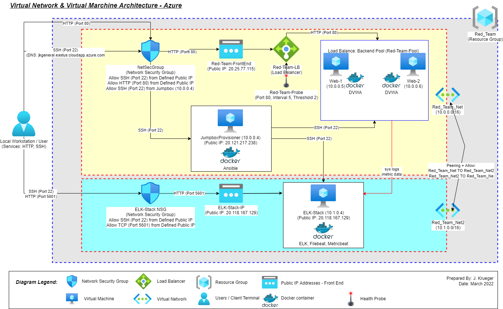
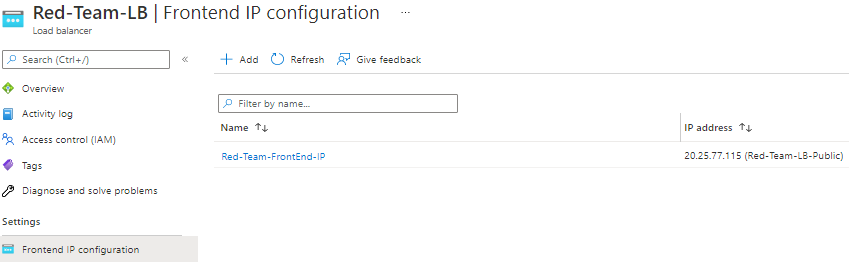
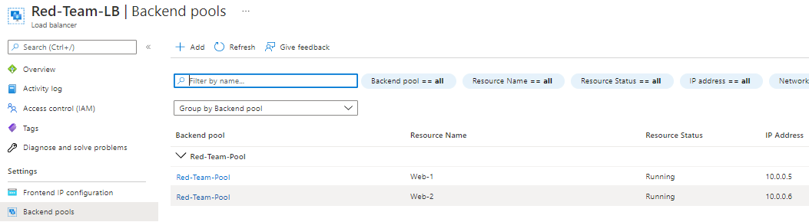
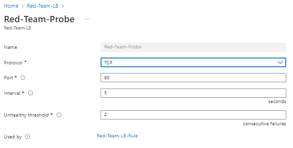

# CyberSecurity_Training
Hello github community! My name is Jim Krueger and I am practicating Internal Auditor specializing in IT Audit.  I hold CISA and CIA certifications.  I am presently studying in the field of cybersecurity.  This repository depicts the archictecture and deployment tools leveraged to setup a MS Azure based virtual network.  The network includes virtual machines, web applications, and ELK-Stack monitoring function. You can find me on [LinkedIn](https://www.linkedin.com/in/jimkrueger1/)

## Project 1 Overview

Project 1 includes the creation of a virtual network with MS Azure.  The virtual network contain virtual machines that hosted web applications and a monitoring solution.  The sections below may be used to either recreate this network, web applications, and monitoring solution.  

This README file contains the following sections:

- **Section 1:** Network Diagram
- **Section 2:** Description of the Topology, Applications, and Monitoring Tool
- **Section 3:** Access Policies
- **Section 4:** ELK Stack Configuration
- **Section 5:** Using Ansible Build & Playbooks

---

### Section 1: Network Diagram

The following represents example MS Azure based virtual network created as part of my training.

(1-Images/VirtualNetworkArchitecture_Mar2022.drawio.png)

---

### Section 2: Description of the Topology, Applications, and Monitoring Tool

  
Expand to see full description of network requirements and resulting topology

The main requirement of this network is to establish a load-balanced and monitored instances of DVWA, the [D*mn Vulnerable Web Application](https://opensourcelibs.com/lib/dvwa?msclkid=4d0d154aab7811ec90879e379f49b7cb).  The second requirement was to setup an application to monitor the DVWA web applications and servers. The [ELK Stack](https://www.elastic.co/) was chosen to perform the monitoring function. Further, modules were added to the ELK Stack solution to perform select monitoring functions.  The modules included: 
- [FILEBEAT](https://www.elastic.co/beats/filebeat?msclkid=e63a6160ad3b11ecae6645121e972632)
- [METRICBEAT](https://www.elastic.co/beats/metricbeat?msclkid=f5e47f1cad3b11ec892bbb985a94eddb).

Additionally, the Docker [Ansible](https://hub.docker.com/r/ansible/ansible/#!?msclkid=5a5f7a68ad3b11ecb803ff2a466d2e90) was used to deploy the applications and associated configuration.  Ansible leverages playbook files to install and configure the application dockers on the target machines. 

A simple network was designed to address the requirements.  A [Microsoft Azure](https://azure.microsoft.com/en-us) network was created to include a two virtual networks, jumpbox, load balancer, and three virtual machines.  The jumpbox, load balancer, and 2 of 3 virtual machines were defined in the virtual network name 'Red-Team--Net' as noted in the table below.  The virtual machines in 'Red-Team-Net' were defined as the web application servers hosting the DVWA application.  The virtual machines hosting DVWA were defined in a _Availability Pool_.  The use of _Availability Pool_ in MS Azure helps to ensure that access to the DVWA's is uniterupted in the event that 1 of the 2 virtual machines were to become unavailable.

The 3rd virtual machine was the designated 'ELK Stack' server. This machine was defined in the virtual network named 'Red-Team-Net2', the macine was also placed in a seperate region of the MS Azure network.  This server host the ELK Stack monitoring application.  The purpose and configuration of the ELK Stack server is described at `Section 3` below.

All virtual machines defined were created with Ubuntu Linux operating systems.  Further, the virtual networks, 'Red-Team-Net' and 'Red-Team-Net2' were configured with peering.  The peering capability in MS Azure allows for virtual networks to transfer data across Azure deployment regions.

Summary of key network components and configurations as follows:

| Name                | Function                  | Virtual Network | IP Address | Operating System |
|---------------------|---------------------------|-----------------|------------| -----------------|
| JumpboxProvisioner  | Gateway                   | Red-Team-Net    | 10.0.0.4   | Linux-Ubuntu     |
| Web-1               | Web-App Server            | Red-Team-Net    | 10.0.0.5   | Linux-Ubuntu     |
| Web-2               | Web-App Server            | Red-Team-Net    | 10.0.0.6   | Linux-Ubuntu     |
| ELK-Stack           | Log Analytics & Alerting  | Red-Team-Net2   | 10.1.0.4   | Linux-Ubuntu     |

 

   
Expand the section below to see key configurations of the virtual networks, load balancer, and jumpbox.

Summary of load balancer:
- _Frontend IP Configuration:_ Public IP address defined as `20.25.77.115`

- _Backend Pools:_ Backend pools that include servers `Web-1` and `Web-2` defined

- _Health Probes:_ Azure Load Balancer rules require a health probe to detect the endpoint status. The configuration of the health probe and probe responses determines which backend pool instances will receive new connections. The health probe in the Red-Team load balancer helps detect the failure of the DVWA application on either `Web-1` or `Web-2` and direct traffic to the active application.

Summary of Jumpbox:
- _Properties of Jumpbox Virtual Machine:_ The Jumpbox virtual provides the benefit of prohibiting external users from directly accessing the `Web-1` and `Web-2` servers, rather the Jumpbox defines what traffic (SSH, HTTP, or other) is allowed through to the servers.

Private IP range of the virtual networks noted above defined as follows:
- **Red-Team-Net:** 10.0.0.0/16
- **Red-Team-Net2:** 10.1.0.0/16

Network peering:
- Configured between the **Red-Team-Net** and **Red-Team-Net2** virtual networks, allowing connection in both directions from virtual machines existing in different regions.
 

---

### Section 3: Access Policies

  
Expand to see full description of access policies

The virtual machines on the internal network are not exposed to the public Internet.  Only the `Jumpbox` virtual machine can accept connections from the Internet. Access to this machine is only allowed from the following IP addresses:
- _Whitelisted IP addresses_: ##.##.156.27 (Note - IP is partially masked to conceal identity)

Machines within the network can only be accessed by the Jumpbox virtual machine.  A summary of the access policies in place can be found in the table below.

| Name               | IP Address   | Publicly Accessible | Allowed IP Addresses   |
|--------------------|--------------|---------------------|------------------------|
| JumpboxProvisioner | 10.0.0.4     | Yes                 | ##.##.156.27           |
| Web-1              | 10.0.0.5     | No                  | 10.0.0.4               |
| Web-2              | 10.0.0.6     | No                  | 10.0.0.4               |
| ELK-Stack          | 10.1.0.4     | Yes                 | ##.##.156.27; 10.0.0.4 |

 

   
Summary of Access Policies

Access Rules - Jumpbox

Access Rules - ELK Stack

 

---

### Section 4: ELK Stack Configuration

  
Expand to see full description of ELK Stack configuration

Ansible was used to automate configuration of the ELK machine. No configuration was performed manually.  The advantages of Ansible include the following related to system configuration:
- **Accuracy:** Leveraging Ansible to automate the setup of ELK machine helps ensure the accurate configuration of settings and flags, helping to eliminate human error.
- **Completeness:** Leveraging Ansible to automate the setup of ELK machine helps ensure the complete setup of a single machine or many machines, helping to eliminate machines from being missed.

 

   
Click here to view details of target machines & beats:

   

- **Target Machines:** _The ELK Stack server is configured to monitor the following machines_

  - Web-1
    - Private IP: 10.0.0.5
    - Applications: DVWA
  - Web-2
    - Private IP: 10.0.0.6
    - Applications: DVWA 

- **Beats Installed:** _The following Beats installed on the aforementioned machines_

  - `FILEBEAT`
    - See URL for more details [Filebeat](https://www.elastic.co/beats/filebeat?msclkid=14613ae2ab6c11ecb5c6c574a3483e0d)
  - `METRICBEAT`
    - See URL for more details [Metricbeat](https://www.elastic.co/beats/metricbeat?msclkid=5485be4aab6c11eca81543bc3775ed66)

- **Information Collected:** These Beats allow us to collect the following information from each machine

  - `BEATS`: Beats are special-purpose data collection modules.
    - Rather than collecting all a machine's log data, Beats allow you to collect only the very specific pieces of information you are interested in.
    - Beats generate and send log file data to either Logstash and Elasticsearch for indexing. Kilbana is then used to visualize the data collected in user friendly depictions.
    - Since 'FILEBEAT' and 'METRICBEAT' collect data about specific files on remote machines, they must be installed on the machines targeted for monitoring.
  - `FILEBEAT`: _Collects data about file system_
    - This beat collects and parses logs from various components of the machines.  Logs targed include the _var/log/*.log_ folder and can be further refined in configuration file if desired.
    - The beat outputs data to the _elasticsearch_ and _Kibana_ modules of ELK Stack.
    - Logs collected and parsed in the project configuration include for example:
      - **nginx**: Records events like visitors to your site and issues it encountered to log files. 
      - **osquery**: Records events like user logins, installed programs, running processes, network connections, or system log collection. 
  - `METRICBEAT`: _Collects machine metrics_
    - This beat collects and parses data/statistics from various system/hardware components of the machines or containers where installed and configured.
    - The beat outputs data the _elasticsearch_ and _Kibana_ modules of ELK Stack.
    - Example statistics collected and parsed include for example:
      - CPU usage, memory, file system, disk IO, and network IO statistics, as well as processes running on your systems.

 

---

### Section 5: Using Ansible Build and Playbooks

  
Expand to see full description of using Ansible build and playbooks

In order to use the playbook, you will need to have an Ansible control node already configured. Assuming you have such a control node provisioned: 

SSH into the control node and follow the steps below:
- Copy the _____ file to _____.
- Update the _____ file to include...
- Run the playbook, and navigate to ____ to check that the installation worked as expected.

_TODO: Answer the following questions to fill in the blanks:_
- _Which file is the playbook? Where do you copy it?_
- _Which file do you update to make Ansible run the playbook on a specific machine? How do I specify which machine to install the ELK server on versus which to install Filebeat on?_
- _Which URL do you navigate to in order to check that the ELK server is running?

 

   
Click here to view the details of playbooks and Docker status

The following are representative steps of installing Ansible docker, defining Ansible hosts file, creating playbooks to install docker(s) and executing created playbooks:
- **Step 1:** Install Docker and Ansible on the previously created `JumpboxProvisioner` virtual machine.
- **Step 2:** Start and access the previously installed Docker container on `JumpboxProvisioner` virtual machine.
  - _Start Docker:_ `sudo docker start {insert docker name}`
  - _Enter Docker:_ `sudo docker exec -ti {insert docker name} /bin/bash`
- **Step 3:** Navigate to folder containing Ansible hosts file and modify to identfiy recognized server groups.
  - _Anisible Host Folder:_ Folder `etc/ansible` contains the hosts file.  Modify to include webserver and ELK Stack grouops, insert server IPs
- **Step 4:** Define relevant playbooks to install ELK Docker against target 10.1.0.4, and install Filebeat and Metricbeat against targets 10.0.0.5 & 10.0.0.6.
  - _Ansible Commands:_ `ansible-playbook {insert playbookname.yaml}

The following screenshot displays the result of running `docker ps` after successfully configuring the ELK instance.

 

---

