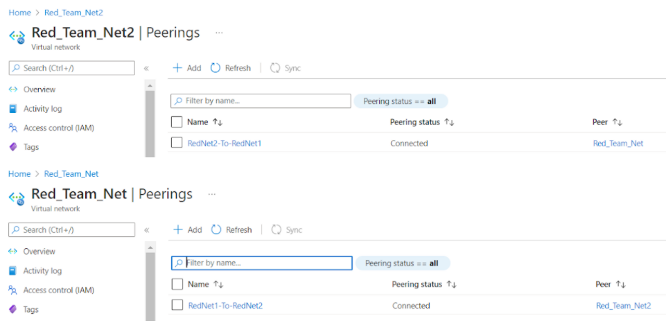

# Azure Network & Elk Stack Project

This repository depicts the summary of cloud application deployment project.

## Project Overview

Project requirements included the creation of a virtual network with MS Azure that host load balanced and monitored web application.  The sections below may be used to either recreate this network, web applications, and monitoring solution.  

This README file contains the following sections:

- **Section 1:** Network Diagram
- **Section 2:** Description of the Topology, Applications, and Monitoring Tool
- **Section 3:** Access Policies
- **Section 4:** ELK Stack Configuration
- **Section 5:** Using Ansible Build & Playbooks
- **Section 6:** Confirm Web-App Function

---

### Section 1: Network Diagram

The following represents example MS Azure based virtual network created as part of my training.

(1-Images/VirtualNetworkArchitecture_Mar2022.drawio.png)

---

### Section 2: Description of the Topology, Applications, and Monitoring Tool

  
Expand to see full description of network requirements and resulting topology

As noted in the overview, project requirements include establishing a load-balanced and monitored web applications.  The web application selected was DVWA, the [D*mn Vulnerable Web Application](https://opensourcelibs.com/lib/dvwa?msclkid=4d0d154aab7811ec90879e379f49b7cb).  

The monitoring solution selected was [ELK Stack - url](https://www.elastic.co/).  Modules added to the ELK Stack solution to perform select monitoring functions included: 
- [FILEBEAT](https://www.elastic.co/beats/filebeat?msclkid=e63a6160ad3b11ecae6645121e972632)
- [METRICBEAT](https://www.elastic.co/beats/metricbeat?msclkid=f5e47f1cad3b11ec892bbb985a94eddb)

Docker [Ansible](https://hub.docker.com/r/ansible/ansible/#!?msclkid=5a5f7a68ad3b11ecb803ff2a466d2e90) was used to deploy the applications and associated configuration files.  Ansible playbook files were created to install and configure the application dockers on the target machines. 

A [Microsoft Azure](https://azure.microsoft.com/en-us) network was created to include a two virtual networks, jumpbox, load balancer, and three virtual machines.  This architecture was designed to host the web applications and monitoring solution.

The jumpbox, load balancer, and 2 of 3 virtual machines were defined in the virtual network name 'Red-Team--Net' as noted in the table below.  The virtual machines in 'Red-Team-Net' were defined as the web application servers hosting the DVWA application.  The virtual machines hosting DVWA were defined in a _Availability Pool_.  The use of _Availability Pool_ in MS Azure helps to ensure that access to the DVWA's is uniterupted in the event that 1 of the 2 virtual machines were to become unavailable.

The 3rd virtual machine was the designated 'ELK Stack' server. This machine was defined in the virtual network named 'Red-Team-Net2', the macine was also placed in a seperate region of the MS Azure network.  This server host the ELK Stack monitoring application.  The purpose and configuration of the ELK Stack server is described at `Section 3` below.

All virtual machines defined were created with Ubuntu Linux operating systems.  Further, the virtual networks, 'Red-Team-Net' and 'Red-Team-Net2' were configured with peering.  The peering capability in MS Azure allows for virtual networks to transfer data across Azure deployment regions.

Summary of key network components and configurations as follows:

| Name                | Function                  | Virtual Network | IP Address | Operating System |
|---------------------|---------------------------|-----------------|------------| -----------------|
| JumpboxProvisioner  | Gateway                   | Red-Team-Net    | 10.0.0.4   | Linux-Ubuntu     |
| Web-1               | Web-App Server            | Red-Team-Net    | 10.0.0.5   | Linux-Ubuntu     |
| Web-2               | Web-App Server            | Red-Team-Net    | 10.0.0.6   | Linux-Ubuntu     |
| ELK-Stack           | Log Analytics & Alerting  | Red-Team-Net2   | 10.1.0.4   | Linux-Ubuntu     |

 

   
Expand the section below to see key configurations of the virtual networks, load balancer, and jumpbox.

Summary of load balancer:
- _Frontend IP Configuration:_ Public IP address defined as `20.25.77.115`

- _Backend Pools:_ Backend pools that include servers `Web-1` and `Web-2` defined

- _Health Probes:_ Azure Load Balancer rules require a health probe to detect the endpoint status. The configuration of the health probe and probe responses determines which backend pool instances will receive new connections. The health probe in the Red-Team load balancer helps detect the failure of the DVWA application on either `Web-1` or `Web-2` and direct traffic to the active application.

Summary of Jumpbox:
- _Properties of Jumpbox Virtual Machine:_ The Jumpbox virtual provides the benefit of prohibiting external users from directly accessing the `Web-1` and `Web-2` servers, rather the Jumpbox defines what traffic (SSH, HTTP, or other) is allowed through to the servers.

Private IP range of the virtual networks noted above defined as follows:
- **Red-Team-Net:** 10.0.0.0/16
- **Red-Team-Net2:** 10.1.0.0/16

Network peering:
- Configured between the **Red-Team-Net** and **Red-Team-Net2** virtual networks, allowing connection in both directions from virtual machines existing in different regions.

 

---

### Section 3: Access Policies

  
Expand to see full description of access policies

The virtual machines on the internal network are not exposed to the public Internet.  Only the `Jumpbox` virtual machine can accept connections from the Internet. Access to this machine is only allowed from the following IP addresses:
- _Whitelisted IP addresses_: ##.##.156.27

Machines within the network can only be accessed by the Jumpbox virtual machine.  A summary of the access policies in place can be found in the table below.

| Name               | IP Address   | Publicly Accessible | Allowed IP Addresses   |
|--------------------|--------------|---------------------|------------------------|
| JumpboxProvisioner | 10.0.0.4     | Yes                 | ##.##.156.27           |
| Web-1              | 10.0.0.5     | No                  | 10.0.0.4               |
| Web-2              | 10.0.0.6     | No                  | 10.0.0.4               |
| ELK-Stack          | 10.1.0.4     | Yes                 | ##.##.156.27; 10.0.0.4 |

 

   
Summary of Access Policies

Access Rules - Jumpbox

Access Rules - ELK Stack

 

---

### Section 4: ELK Stack Configuration

  
Expand to see full description of ELK Stack configuration

Ansible was used to automate configuration of the ELK machine. No configuration was performed manually.  The advantages of Ansible include the following:
- **Accuracy:** Leveraging Ansible to automate the setup of ELK machine helps ensure the accurate configuration of settings and flags, helping to eliminate human error.
- **Completeness:** Leveraging Ansible to automate the setup of ELK machine helps ensure the complete setup of a single machine or many machines, helping to eliminate machines from being missed.

 

   
Click here to view details of target machines & beats:

   

- **Target Machines:** _The ELK Stack server is configured to monitor the following machines_

  - Web-1
    - Private IP: 10.0.0.5
    - Applications: DVWA
  - Web-2
    - Private IP: 10.0.0.6
    - Applications: DVWA 

- **Beats Installed:** _The following Beats installed on the aforementioned machines_

  - `FILEBEAT`
    - See URL for more details [Filebeat](https://www.elastic.co/beats/filebeat?msclkid=14613ae2ab6c11ecb5c6c574a3483e0d)
  - `METRICBEAT`
    - See URL for more details [Metricbeat](https://www.elastic.co/beats/metricbeat?msclkid=5485be4aab6c11eca81543bc3775ed66)

- **Information Collected:** These Beats allow us to collect the following information from each machine

  - `BEATS`: Beats are special-purpose data collection modules.
    - Rather than collecting all a machine's log data, Beats allow you to collect only the very specific pieces of information you are interested in.
    - Beats generate and send log file data to either Logstash and Elasticsearch for indexing. Kilbana is then used to visualize the data collected in user friendly depictions.
    - Since 'FILEBEAT' and 'METRICBEAT' collect data about specific files on remote machines, they must be installed on the machines targeted for monitoring.
  - `FILEBEAT`: _Collects data about file system_
    - This beat collects and parses logs from various components of the machines.  Logs targed include the _var/log/*.log_ folder and can be further refined in configuration file if desired.
    - The beat outputs data to the _elasticsearch_ and _Kibana_ modules of ELK Stack.
    - Logs collected and parsed in the project configuration include for example:
      - **nginx**: Records events like visitors to your site and issues it encountered to log files. 
      - **osquery**: Records events like user logins, installed programs, running processes, network connections, or system log collection. 

  - `METRICBEAT`: _Collects machine metrics_
    - This beat collects and parses data/statistics from various system/hardware components of the machines or containers where installed and configured.
    - The beat outputs data the _elasticsearch_ and _Kibana_ modules of ELK Stack.
    - Example statistics collected and parsed include for example:
      - CPU usage, memory, file system, disk IO, and network IO statistics, as well as processes running on your systems.

**Note:** See _Section 6_ below for evidence of the beat agents logging activity.

 

---

### Section 5: Using Ansible Build and Playbooks

The JumpboxProvisioner virtual machine was setup with Docker.  Further the Ansible Docker container was installed on the JumpboxProvisioner virtual machine.  The instructions below assume these steps have been performed and the Ansible control node exist.

  
Click here to view the steps defined

**Step 1 - Access JumpboxProvision Ansible Node:**
To begin the installation of the DVWA docker and ELK Stack containers on the target machines, we will ‘SSH’ from local host into the JumpboxProvisioner using the following command:
- $ ssh -i ~/ssh/id_rsa _userID_@DNS-address.azure.com

After successfully accessing the JumpboxProvision machine, start the previously installed Docker container:
- $ sudo docker start _docker-name_

Image of installed docker on JumpboxProvisioner:

Enter the Docker container on JumpboxProvisioner with the following command:
- $ sudo docker exec -ti sweet_elbakyan /bin/bash

Image of docker container:

**Step 2 – Modify Ansible Host File:**
The Ansible ‘etc/host’ file requires update to have visibility to the target machines.  Our etc/ansible/hosts file was updated to include a group of servers titled ‘webservers’ and another group of servers titled ‘elk’.  The private IP of the target servers was entered into each group as follows:

**Step 3 – Create & Ansible Playbooks for DVWA, ELK, Filebeat, and Metricbeat:**
The following folder structure was created on the Ansible docker to accommodate the playbook and configuration files:
- Etc/ansible/{hosts file}
- Etc/ansible/roles/{playbook files}
- Etc/ansible/roles/files{configuration files}

 

   
Click here to view the playbook files created

Playbooks created as follows:

 

 

   
Click here to vieew the configuration files created

Configuration files created as follows:

 

**Step 4 – Run Playbooks:**
The following command is used to run playbooks:
- $ ansible-playbook {playbook-name}

Note this command must be run from the folder containing the playbook files.

Run results outputed to the terminal screen.

**Step 5: Confirm Installation:**

Navigate to the individual virtual machines (Web-1, Web-2, and ELK-Stack) and check docker status as follows:

Navigate to individual machines:
- $ ssh -i .ssh/id_rsa userID@10.0.0.#

Check Docker status from command line:
- $ sudo docker ps

 

   
Click here to see status of DVWA and ELK-Stack Dockers

**Docker Views:**
(1) Web-1 DVWA:

(2) Web-2 DVWA:

(3) ELK-Stack:

 

---

### Section 6: Confirm Web-App Function

  
Click here to see evidence of Web-App function

**Web App Portal Views:**

(1) DVWA:
- Enter the public IP assigned by Azure

(2) ELK-Stack:
- Enter the public IP assigned by Azue

**Kibana Logging Evidence:**

(1) Filebeat:
- See image below for evidence of the active Filebeat agent on Web-1 and Web-2:

(2) Metricbeat:
- See image below for evidence of the active Metricbeat agent on Web-1 and Web-2:

---
